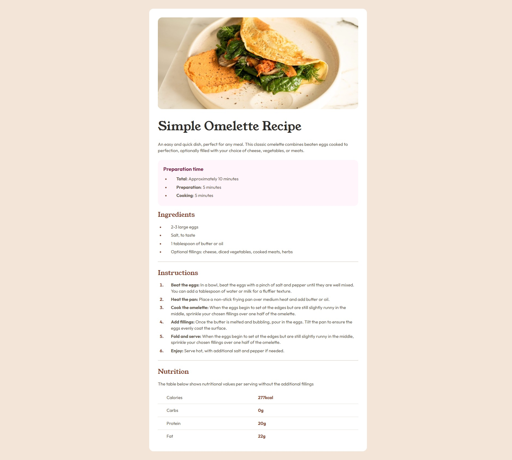

# Frontend Mentor | Recipe Page
 
## ✨ Overview

### 🖼️ Project Screenshot

### 🔗 Project Links
Solution: [Open](https://www.frontendmentor.io/solutions/used-html5-css3grid-google-font-vars-and-aria-for-accessibility-eWMg5Pc5DN)

Live Site: [Open](https://dynamic-brigadeiros-07d903.netlify.app/)

### ✍ My Process

This project is a recipe page, created as part of a Frontend Mentor challenge. The goal was to build a responsive and accessible layout while maintaining clean and efficient code.

#### Technologies & Techniques Used:

- **HTML5:**
    - Implemented semantic elements like `<main>` and `<section>`, and  to enhance document structure.
    - Applied ARIA labels to provide better context for assistive technologies (e.g., `aria-label="Instructions"`).
    - Used descriptive alt attributes for images to support screen readers and improve accessibility.

- **CSS3:**
    - Utilized CSS Grid and Flexbox to create a responsive and well-structured layout.
    - Applied CSS variables `:root` for better maintainability of colors and consistent theming.
    - Styled list markers with `::marker` to differentiate list items visually.
    - Used media queries to ensure the layout adapts correctly on smaller devices.

- **Accessibility Enhancements:**
    - Ensured accessible navigation by adding ARIA labels to key content sections like ingredients, instructions, and nutritional information.
    - Adjusted color contrast between text and background based on WCAG guidelines.
    - `<ul>` and `<ol>` tags are used for the ingredients and instructions, ensuring that screen readers can properly interpret the sequence of items.
    - The use of `<section>` elements to group related content (e.g., recipe image, preparation time, ingredients, instructions, and nutritional information) improves document structure, making it easier for users with disabilities to navigate the page.

- **Responsive Design:**
    - Adopted a mobile-first approach, ensuring compatibility with various screen sizes.
    - Applied `max-width: 800px` to prevent content from becoming too wide on larger displays.
    - Utilized `place-content`: center with CSS Grid to center the content both vertically and horizontally.

## 👨‍💻 Autor

Gabriel Andrade  
[GitHub](https://github.com/4ndradeGabriel)  
[LinkedIn](https://www.linkedin.com/in/andradegabrielw)  

---

Desenvolvido por [Gabriel Andrade](https://github.com/4ndradeGabriel)